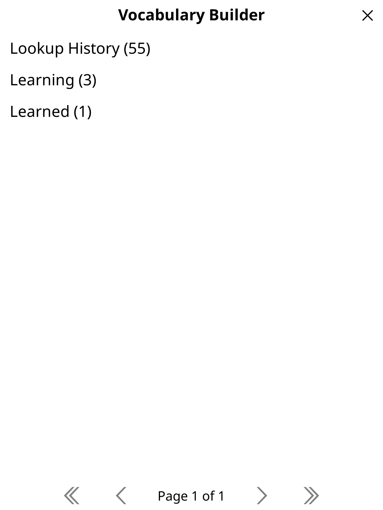
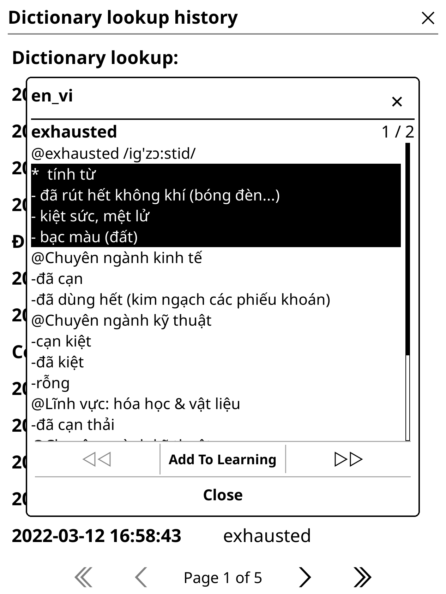
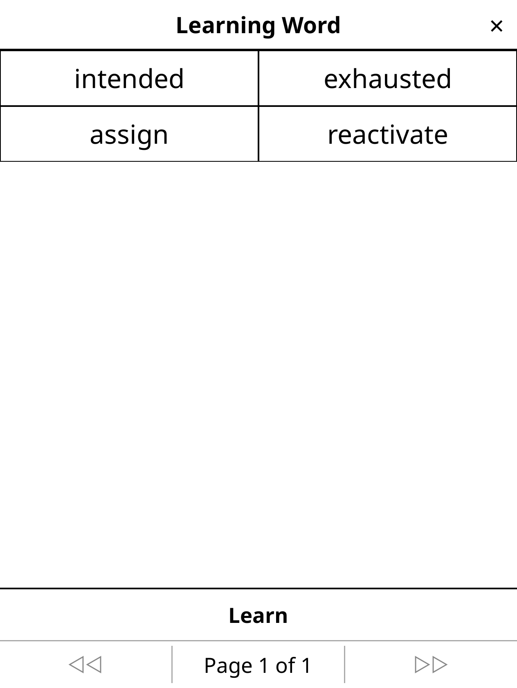
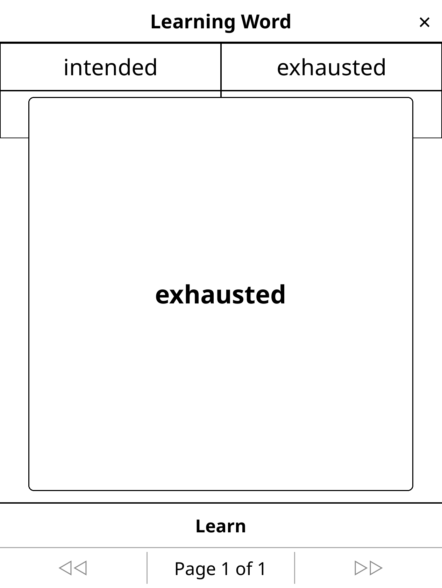
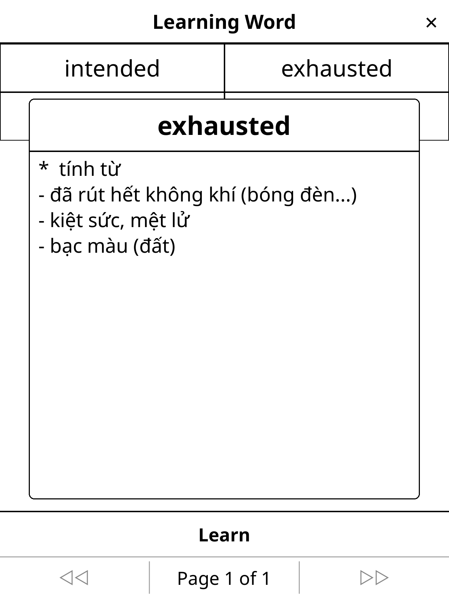
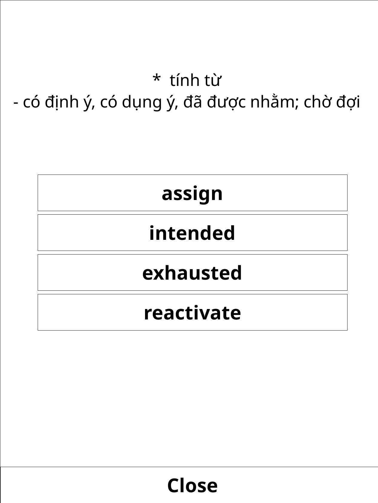
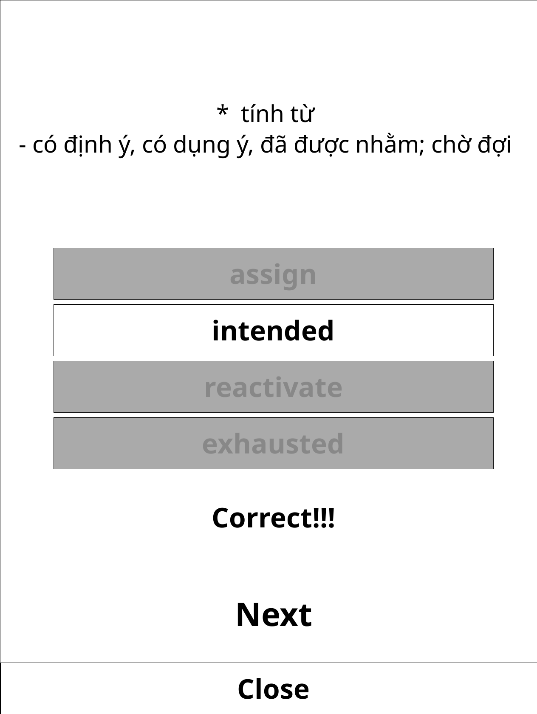
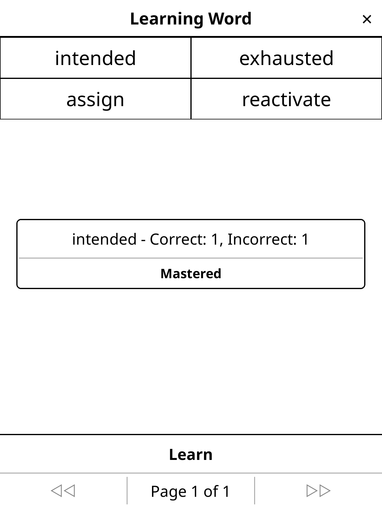
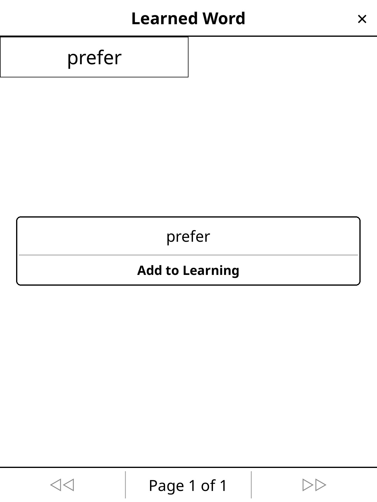

# Vocabulary Builder plugin for KOReader
## Feature
### Menu

### Choose word and definition add to learning

### Learning ui

### Flashcard

### Multiple-choice game

### Hold item to open dialog menu

### Mastered word

## How to install
1. First you need to install [KOReader](https://koreader.rocks/): [here](https://github.com/koreader/koreader/releases)
2. Download code and put it in plugins folder of KOReader
3. Have fun
